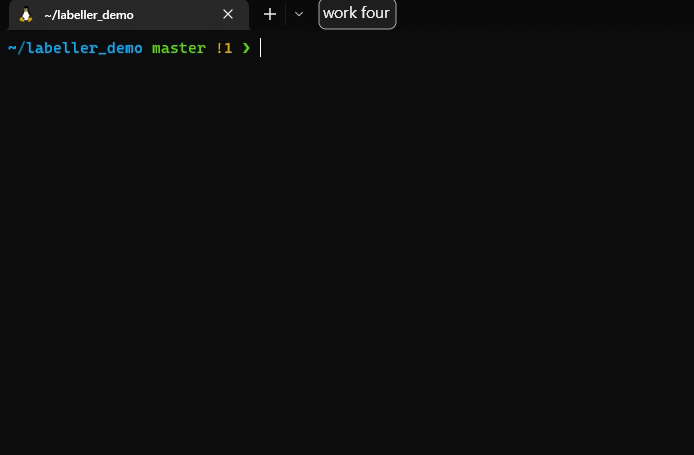

# Git item labeller for Talon


These scripts replace git commands, numbering items in the output and creating a talon list of the items so they can be referred to with voice commands. For example:
```
$ git tl-status
On branch master

No commits yet

Untracked files:
  (use "git add <file>..." to include in what will be committed)

   1.   .gitignore
   2.   README.md
   3.   status.py
   4.   utils.py

nothing added to commit but untracked files present (use "git add" to track)
```
with the following items being added to a list:
```
{'one': '.gitignore', 'two': 'README.md', 'three': 'status.py', 'four': 'utils.py'}
```

## Instructions
TODO

3. Create some commands to use the `git_status_items` and `git_branch_items` lists, e.g.:
```
git status: "git_status\n"
git add {user.git_status_items} [(and {user.git_status_items})+]:
      items = user.cat(git_status_items_list, "' '")
      "git {git_actions} '{items}'"
git go {user.git_status_items}: user.cd_directory_of(git_status_items)
git file {user.git_status_items}: "'{git_status_items}'"
